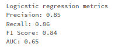
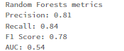
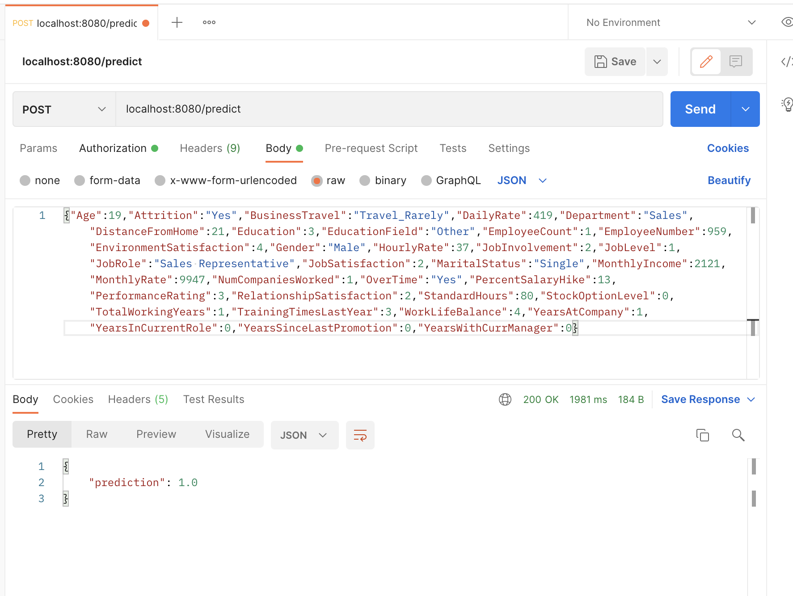
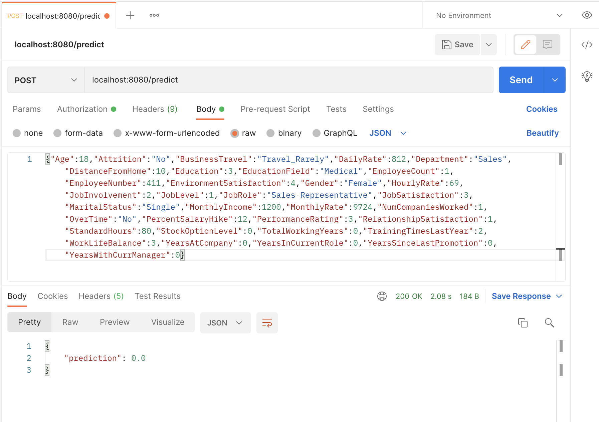

Employee attrition prediction problem involves predicting whether an employee will leave their job or not. This can be useful for companies to take preventive measures to retain their valuable employees and reduce the attrition rate. 

Using the dataset https://raw.githubusercontent.com/msellamiTN/Machine-Learning-with-Python/master/data/HR-Employee-Attrition.csv, This project aims to build a  SUPERVISED predictive model to solve this problem. 

## Prerequisites
    - Docker
    - Docker Compose

## Explanation
### Step 1: Model Building
The notebook containing the code for model building, exported from Databricks, is available in the files.

1. Data Cleaning and Preparation:
The initial step involved conducting a thorough data exploration on the dataset. We ensured that the dataset columns had the correct format, checked for the presence of NaN values, and gained an understanding of the columns that contained a significant number of zeros. As a result, we found no NaN values, and the following columns had zero values:
NumCompaniesWorked: 13.4%, StockOptionLevel: 42.93%, YearsInCurrentRole: 16.6%, YearsSinceLastPromotion: 39.52%, YearsWithCurrManager: 17.89%. We inferred that these zero values were consistent with the meaning of zero in each column.

We also performed a correlation analysis between different columns and identified a strong correlation between the JobLevel and MonthlyIncome columns. Therefore, we decided to choose one of them for our analysis, eliminating the need to work with both columns.

2. pipeline build and model traninig and evaluation:

To prepare our data for training, we developed a pipeline that enables the creation and transformation of features. The pipeline consists of multiple stages that are executed in sequence, with the data flowing from one end to the other.

The stages of our pipeline are:

* Feature Transformation:
    * Convert categorical data into encoded data using stringIndexation and OneHotEncoder
    * Scale each variable to unit variance using the Standar Scaler.

* Feature Extraction:
    * Convert our regular columns into Spark feature vectors using vectorization.

To train our model, we split our data into two sets: a training set that contains 80% of the data and a testing set that contains the remaining 20%. We followed the Pareto rule to determine the split.

As our use case is binary classification, we tested two machine learning models: Logistic Regression and Random Forest. We evaluated the performance of these models on the testing set using standard metrics such as precision, recall, F1 score and AUC.

We obtained the following evaluation results for our models:
* Logistic regression Evalution:

* Random Forest Evalution:

> As shown in the results of different evaluators, the Logistic Regression model gave better results so we chose it as our prediction model. We also used cross-validation to ensure that the model is not overfitting to the training data and we had a result of 0.84 .

3. model export:
As a final step, we saved the trained model to a file format that can be easily shared or deployed. This exported model can then be loaded into a new environment to make predictions on new data which is the next step of our project.

### Step2: Building the Flask API
You can find the code responble of API creation ans starting in `app python file`.
We first loaded the pre-trained machine learning model that we exported earlier using PySpark's PipelineModel class.

Then we created the Flask app with an API route for receiving input data and returning predictions. The input data is expected to be in JSON format and to be able to be consumed by the model, we needed to convert it to a PySpark DataFrame.

Once the input data is transformed, it's then used by the loaded model to generate the prediction, which is returned as a JSON object. 

Finally, the Flask app is started and made available at the specified host and port. the Flask API will be running on the port localhost:8080. The model can now be applied to new data to make predictions on the probability of employee attrition.

We attempted to provide new data using a POST query on Postman, as follows: localhost:8080/predict. The results obtained are shown below:
* label = 1:

* label = 0

### Step3: Containerization
To make the deployment of the application easier in other environments, we defined a dockerfile that builds a Docker image for the Flask API and a docker-compose file that defines the configuration needed to run the Flask API.

To be able to run the containerized application, proceed as follow:

    1- Clone the repository: git clone https://github.com/SanaHassen/Mini-projet-Machine-learning-avec-MLLIB.git
    
    2- Build Python image and start the containers: docker-compose up --build

